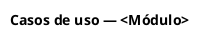
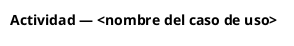

# `<CU-MOD-nn>` — `<Nombre del caso de uso>`

> **Plantilla estándar de casos de uso de este repositorio.** Reutiliza la estructura que Zurich Santander ya conoce y validó en otros proyectos (entre ellos, el de Emisión, donde tiene carácter contractual). Aquí **no** tiene ese carácter fijo: es el formato por defecto, y se puede modificar con criterio — por ejemplo, para ajustarlo a algo propio del Configurador como el manejo de versiones de producto — siempre que el cambio quede justificado y registrado en el control de versiones del documento. Si no hay una razón concreta para apartarse de ella, se usa tal cual, porque cambiar de formato sin necesidad solo le cuesta tiempo de lectura al cliente.
> Habilidad de referencia: `.claude/skills/constructor-casos-uso/SKILL.md`.

---

| | |
| :--- | :--- |
| **Proyecto** | ODÍN — Configurador de Productos (Fábrica de Productos) |
| **Código de proyecto** | Pendiente de asignación |
| **Cliente** | Zurich Santander Seguros México · Banco Santander México |
| **Proveedor** | Softtek |
| **Documento** | Caso de uso — `<nombre>` |
| **Bloque funcional** | `<código y nombre>` |
| **Ámbito** | `<Open Market · Credit Related · Ahorro e Inversión · Todos>` |
| **Versión** | `<v0.1>` |
| **Estado** | `<Borrador · En construcción · Completo · Auditado>` |
| **Fecha** | `<AAAA-MM-DD>` |
| **Clasificación** | Confidencial — Grupo Zurich / Grupo Santander |

## Control de versiones

| Versión | Fecha | Autor | Descripción del cambio | Origen del cambio |
| :---: | :---: | :--- | :--- | :--- |
| 0.1 | | | Versión inicial | |

---

## 1. Lista de casos de uso

| ID | Caso de uso | Ejecutor |
| :--- | :--- | :--- |
| `CU-<MOD>-<nn>` | `<nombre>` | `<actor>` |
| `CU-<MOD>-<nn>.<mm>` | `<nombre del subcaso>` | `<actor>` |

---

## 2. Casos de uso

### 2.1 `<CU-MOD-nn>` — `<Nombre>`

#### 2.1.1 Identificación

| Campo | Contenido |
| :--- | :--- |
| ID de caso de uso | `CU-<MOD>-<nn>` |
| Nombre del caso de uso | `<verbo en infinitivo + objeto>` |
| Módulo funcional | `<código y nombre del bloque>` |
| Ámbito | `<Open Market · Credit Related · Ahorro e Inversión · Todos>` |
| Creado por | `<nombre>` |
| Fecha de creación | `<AAAA-MM-DD>` |
| Última actualización por | `<nombre>` |
| Fecha de última actualización | `<AAAA-MM-DD>` |

#### 2.1.2 Actores

| Actor | Tipo | Permiso requerido | Descripción de su participación |
| :--- | :--- | :--- | :--- |
| `<nombre del actor como lo llama el negocio>` | `<Primario · Secundario · Sistema>` | `<rol>` | |

#### 2.1.3 Descripción

`‹Una a tres oraciones: qué permite hacer y qué valor entrega. Sin contexto de proyecto.›`

#### 2.1.4 Precondiciones

1. `‹Lo que debe ser cierto antes de iniciar: estado del sistema, permisos, datos disponibles. Cita [RN-…] cuando aplique.›`

#### 2.1.5 Post-condiciones

1. `‹Lo que es cierto al terminar con éxito: estado persistido, versión de producto generada, oferta publicada, catálogos actualizados, información disponible para procesos secundarios (Cotización, Emisión).›`

#### 2.1.6 Flujo normal

| # | Actor | Acción |
| :---: | :--- | :--- |
| 1 | `<Actor>` | `‹El usuario … ›` |
| 2 | Sistema | `‹El sistema … [RN-<MOD>-<nnn>], [RNF-<nnn>], [FA01]›` |

`‹Cada paso empieza con el sujeto y describe una acción observable. Toda condición cita su regla entre corchetes.›`

#### 2.1.7 Flujos alternativos

**FA01 — `<Nombre del flujo alterno>`**

| | |
| :--- | :--- |
| **Condición** | `<qué lo dispara, y en qué paso del flujo normal>` |
| **Acción del sistema** | `<qué hace, paso a paso>` |
| **Retorno** | `<a qué paso del flujo normal regresa, o si termina el caso de uso>` |

`‹Cubre, cuando apliquen: datos inválidos, sin resultados, servicio externo no disponible, timeout, permisos insuficientes, duplicidad y rechazo de negocio.›`

#### 2.1.8 Variantes

`‹Diferencias por producto, ramo, canal o ámbito que no justifican un caso de uso aparte. Si no hay: N/A.›`

#### 2.1.9 Prioridad y frecuencia de uso

| | |
| :--- | :--- |
| **Prioridad** | `<Alta · Media · Baja>` |
| **Frecuencia de uso** | `<estimación con unidad, p. ej. «~40 ofertas nuevas/mes»>` |
| **Fuente de la estimación** | `<INS-nnnn §x>` |

`‹Sin evidencia, se usa [PENDIENTE - REF: DUD-…], no N/A.›`

#### 2.1.10 Reglas de negocio

| ID RN | Nombre de la regla | Descripción |
| :--- | :--- | :--- |
| `RN-<MOD>-<nnn>` | `<frase nominal corta>` | `<enunciado completo, idéntico al del catálogo E02>` |

#### 2.1.11 Requerimientos especiales

| ID RNF | Descripción | Umbral | Verificación |
| :--- | :--- | :--- | :--- |
| `RNF-<nnn>` | | | |

#### 2.1.12 Premisas y notas

| ID | Premisa o nota | Impacto si resulta falsa |
| :--- | :--- | :--- |
| `SUP-<nnn>` | | |

---

## 3. Diagramas

### 3.1 Diagrama de casos de uso del módulo

<!-- diagrama: tipo=casos-uso nombre=<slug-del-modulo> -->


### 3.2 Diagrama de actividad — `<CU-MOD-nn>`

<!-- diagrama: tipo=actividad nombre=<slug-del-cu> -->


### 3.3 Diagrama de secuencia — `<CU-MOD-nn>`

<!-- diagrama: tipo=secuencia nombre=<slug-del-cu> -->
```plantuml
@startuml
title Secuencia — <nombre del caso de uso>
autonumber
@enduml
```

`‹Obligatorios: casos de uso del módulo (una vez por documento); actividad por cada CU con más de una decisión; secuencia por cada CU que involucre dos o más sistemas, incluyendo el camino de error. Compilar con scripts/compile_diagrams.py antes de entregar.›`

---

## 4. Glosario de términos

| Término | Definición |
| :--- | :--- |
| | |

`‹Solo los términos que aparecen en este documento. La definición canónica vive en E09_Glosario.›`

---

## 5. Anexo — Mapeo de datos

### 5.1 Pantalla / Interfaz: `<nombre>`

| Elemento | Tipo de elemento | Valor predeterminado | Tipo de dato y longitud | ¿Requerido? | Entrada / Salida | Validación / Comentarios |
| :--- | :--- | :--- | :--- | :---: | :--- | :--- |
| | | | | | | |

### 5.2 Datos a registrar en base de datos

| Dato origen | Campo | Tabla | Comentarios |
| :--- | :--- | :--- | :--- |
| | | | |

`‹Los nombres de tabla y campo del legacy o del módulo Administrador se escriben exactamente como existen en el sistema origen. Si no se conocen: [PENDIENTE - REF: DUD-…].›`

---

## 6. Anexos generales

`‹Catálogos de mensajes de error, códigos de rechazo, tablas de validación transversales al documento.›`

---

## 7. Fuera de alcance

| ID | Tema | Motivo | Quién lo declaró | Destino |
| :--- | :--- | :--- | :--- | :--- |
| | | | | |

`‹Sección obligatoria aunque esté vacía.›`

---

## Aprobaciones

| Rol | Nombre | Organización | Fecha | Firma |
| :--- | :--- | :--- | :---: | :--- |
| Elaboró | | Softtek | | |
| Revisó | | Softtek | | |
| Aprobó — Negocio | | Zurich Santander | | |
| Aprobó — Arquitectura | | Zurich Santander | | |

---

## Aviso de confidencialidad

La información contenida en este documento es propiedad de **Zurich Santander Seguros México, S.A.** y **Banco Santander México, S.A.**, y tiene carácter **confidencial**. Su contenido no podrá ser divulgado, reproducido, ni utilizado, total o parcialmente, para fines distintos a los del proyecto ODÍN sin autorización previa y por escrito de sus titulares.

Los ejemplos de datos incluidos en este documento son **sintéticos** y no corresponden a personas reales.
